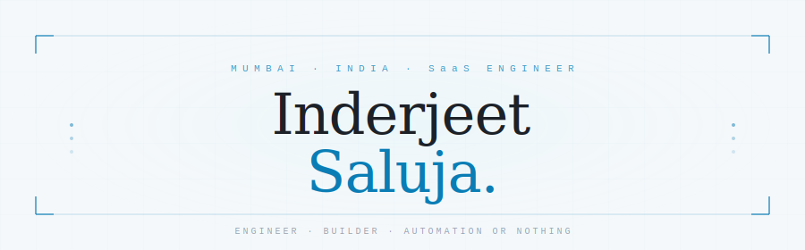

<div align="center">



<br/><br/>

[](https://all-abt-inderjeet.vercel.app/) 
&nbsp;&nbsp;
[](https://www.linkedin.com/in/inderjeet-saluja/)
&nbsp;&nbsp;
[](mailto:inderjeet.saluja97@gmail.com) 

</div>

<br/>

---

<table>
  <tr>
    <td valign="top" width="55%">

### `$ whoami`

Engineer with **6+ years across SaaS** — automation, debugging, solution engineering, and the occasional 2am production fix.

Currently a **Solution Engineer** at [TestMu AI (LambdaTest)](https://www.lambdatest.com), helping enterprise teams get real value out of complex testing infrastructure. Before that — SailPoint, BrowserStack, Directi.

Led engineering at [PromptCue](https://promptcue.com) in the past — an AI platform for multi-LLM interaction from zero to launch with a **16-person team**.

`📍 Mumbai, India`

  </td>
  <td valign="top" width="45%">

### `$ cat about.txt`

```
> Automation is the answer. What's the question?
> Built 5 tools nobody asked for — all still running
> Fav bug: the one that only happens in production
> 200+ hrs in flight sims. Still can't land smoothly.
> Currently obsessing over LLM agents
```

  </td>
  </tr>
</table>

---

### `$ ls ./projects`

<table>
  <tr>
    <td width="50%" valign="top">
      <h4><a href="https://promptcue.com">⟶ PromptCue</a></h4>
      <p>AI platform for interacting with multiple LLMs from a single interface. Built and led a 16-person eng team from zero to launch.</p>
      <p>
        
        
        
        
      </p>
    </td>
    <td width="50%" valign="top">
      <h4>⟶ Ticket Sentinel</h4>
      <p>Three-mode SLA monitoring for support tickets — new breaches, stale cases, cross-team blockers. Escalates automatically when thresholds are missed.</p>
      <p>
        
        
        
      </p>
    </td>
  </tr>
  <tr>
    <td width="50%" valign="top">
      <h4>⟶ Jira Guardian</h4>
      <p>Monitors FreshDesk tickets blocked on other teams and auto-syncs their status from linked Jira — SLA compliance without manual checks.</p>
      <p>
        
        
        
      </p>
    </td>
    <td width="50%" valign="top">
      <h4>⟶ Automated Roster</h4>
      <p>Monthly shift scheduling for an entire support team, auto-published to Google Sheets. Replaced a manual process that took hours each month.</p>
      <p>
        
        
        
      </p>
    </td>
  </tr>
  <tr>
    <td width="50%" valign="top">
      <h4>⟶ Log Analyzer</h4>
      <p>Parses BrowserStack session logs across test frameworks, highlights exact failure lines. Saved hours of manual log digging per week.</p>
      <p>
        
        
        
      </p>
    </td>
    <td width="50%" valign="top" align="center">
      <br/><br/>
      <a href="https://github.com/Inderjeet0007?tab=repositories">
        
      </a>
    </td>
  </tr>
</table>

---
### `$ cat stack.json`

<br/>

[](https://skillicons.dev)
[](https://skillicons.dev)
[](https://skillicons.dev)

<br/>

**`// also in the toolbox`**

`Playwright` &nbsp;`Appium` &nbsp;`Jira` &nbsp;`OpenSearch` &nbsp;`Kibana` &nbsp;`Elasticsearch` &nbsp;`BrowserStack` &nbsp;`Percy` &nbsp;`Zendesk` &nbsp;`Freshdesk` &nbsp;`Handlebars` &nbsp;`MS SQL Server`

<br/>

**`// beyond the code`**

`TCP/IP` &nbsp;`HTTP/HTTPS` &nbsp;`SSL/TLS` &nbsp;`VPNs` &nbsp;`Firewalls` &nbsp;`Hiring & onboarding` &nbsp;`Code reviews` &nbsp;`1:1s` &nbsp;`Agile / Scrum`

---

### `$ tail -f status.log`

| key | value |
|---|---|
| `day_job` | Solution Engineer @ TestMu AI — enterprise teams, CI/CD, automation |
| `side_quest` | AI agents and LLM tooling. Building things, breaking things. |
| `honest_truth` | Trying not to over-engineer everything. Not going well. |
| `open_to` |  |
